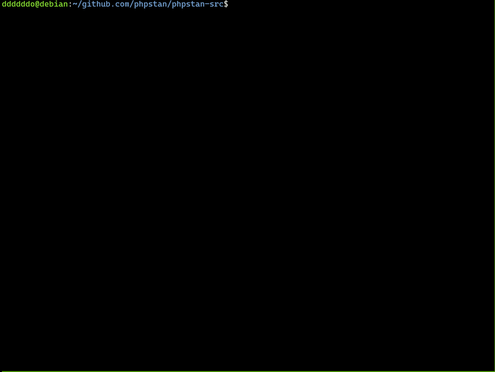

# 💊PP-Aid
Tool that **aid**s **P**HPUnit and **P**COV (pronounced /piːpiːeɪd/)

Running tests takes a lot of time, and generating test coverage also takes a significant amount of time.
This tool might be useful in such situations.



## With this tool,
1. Select test files to run,
1. Select files for which you want to generate coverage reports (HTML),
1. You might be able to execute steps 1 and 2 easily and quickly. Probably. Probably..

## Which test files can be selected?
Files located in `tests/` directory.

## What files can be selected to get coverage?
Files located in `src/` or `app/` directory.

## Install

### Homebrew

```console
brew install ddddddO/tap/ppaid
```

### Go
```console
go install github.com/ddddddO/ppaid/cmd/ppaid@latest
```

## Processing of PP-Aid
todo: 英語もほしい

1. 選択されたテストファイルのパスを取得(複数可)
1. 選択されたカバレッジレポートを生成したいファイルのパスを取得(複数可)
1. 2の最長一致のパス(ディレクトリパス)を計算
1. 2と3を元に`phpunitxml_generated_by_ppaid.xml`を生成
1. 実行する`php`コマンドを組み立て、実行する
1. `coverage-ppaid`ディレクトリ配下にカバレッジレポートが生成される

> [!WARNING]
> ※`ppaid`初回実行時に、`~/.config/ppaid.toml`という設定ファイルができます。
> この設定ファイル内のキー:`CommandToSpecifyBeforePHPCommand`にdockerコマンド越しにphpコマンドを実行するよう記載していますが、直接phpコマンドを実行したい場合は、このキーの値を`""`にしていただくか、この行ごと消してください。

## TODO
- [ ] 選択肢にディレクトリも出してるけど、選択しても今使えないので、使えるようにする（か、大変そうなので選択肢に出さないようにするでもいいかも、そういう目的でもないし）
- [ ] カバレッジレポートをHTML形式以外でも出力できるようにする
- [ ] ヒストリー機能欲しい
    - 何度もファイル選択は手間。ただ、ツールで組み立てられたコマンドは表示されるので、それコピペで実行でも代替できるから後でいいかも